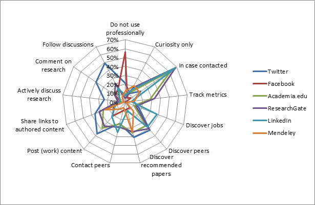

---

<!-- Social networks have changed the way that science is talked about and discovered online. (Has it? tk) -->

### Scientists and the social network

An Nature survey of 3,600 academics sought to discover exactly how social networks have changed the way that science is talked about and discovered online.

<!-- RVN conducted the survey and presented us with the data. -->

<!-- The survey asked questions about 17 different social networks.  -->

<!-- Of these 17 only google scholar, twitter, facebook, researchgate, linkedin, academia.edu, google +, Mendeley ...tk -->

In the course of the survey if a respondent identified as a regular user of one or more network they were given more focused questions about how they use one of these networks.

Richard plotted the results of this question on radar diagrams for the six networks that received the most regular users. 

Note the survey was actually biased to ask questions about ResearchGate if the respondent said they were a regular user of ReasearchGate amongst others. 

Radar diagrams show the activities ‘regular’ users (subset) said they used these networks for, professionally.

Richard was excited to see the differences in range of actual activity on the networks. 

As you might expect you can see that most people do not use Facebook professionally and people login to LinkedIn to discover jobs. 

The most interesting finding is that people seem to maintain their profiles on Academia.edu, ResearchGate and Mendeley in case someone should try to contact them their, rather that to post their research or follow discussions. 

This goes against claims made by these sites.

We decided that these radar diagrams could form the basis of an interactive graphic. 

We decided that a radar chart wasn't the correct choice in this instance - if only because the lines used imply a correlation between the variants.

We then decided, perhaps erroneously, to switch from Excels to standard radar charts to pay tribute to Florence Nightingale's polar area diagrams. 

<!-- Instead we would make a Florence Nightingale rose chart - or polar area diagram:
http://en.wikipedia.org/wiki/File:Nightingale-mortality.jpg -->

<!-- (Note very revealing similarities in way Academia.edu and ResearchGate are used). Something like this could go in print. -->

Typically polar area diagrams, or rose charts if you prefer are used to plot cyclical phenomena such as count of deaths by month. Also the radius axis should be plotted as a square root of the actual value to give the segments proportional area tk...

But we ignored both of these conventions.

First we tried layering each rose chart six rose charts on top of each other. But this hot mess wasn't very informative.

Next we tried ordering each segment was stacked in descending order. 

I'm sure you can don something more interesting with this data. Go on! 

NPG 2014 Social Networks survey: http://figshare.com/articles/NPG_2014_Social_Networks_survey/1132584

Github link https://github.com/chris-creditdesign/nature-social-networks
Article link: http://www.nature.com/news/online-collaboration-scientists-and-the-social-network-1.15711
