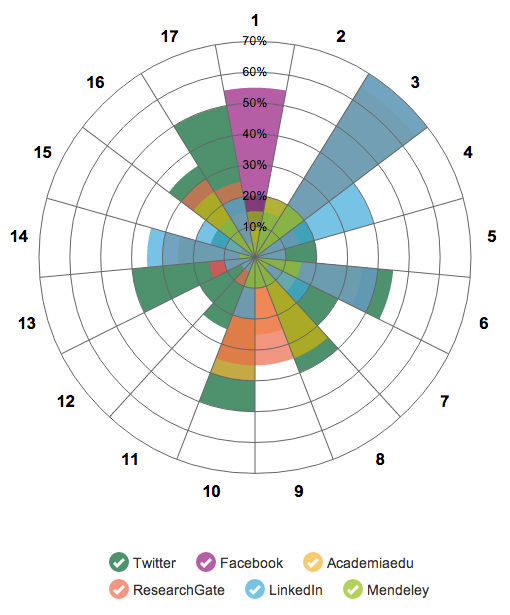
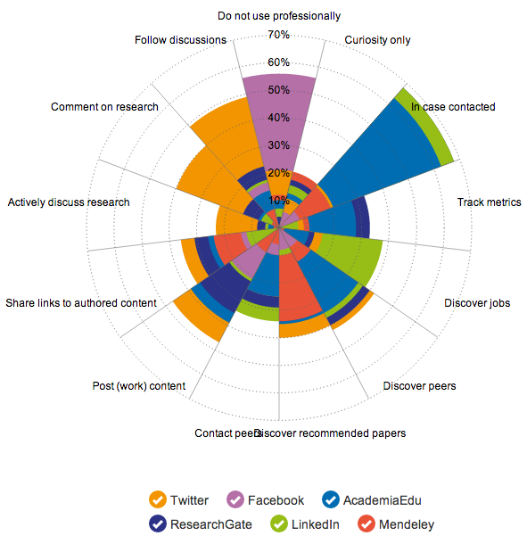
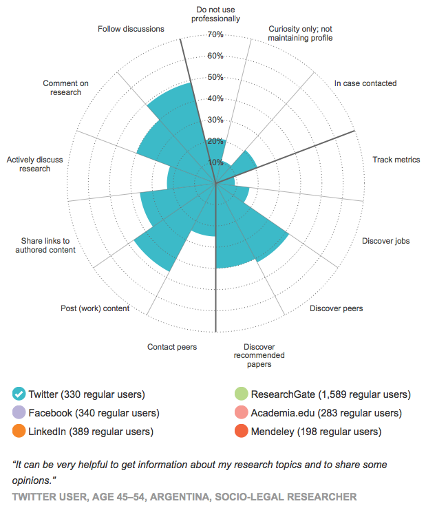

---

<!-- Social networks have changed the way that science is talked about and discovered online. (Has it? tk) -->

### A ROSE BY ANY OTHER NAME

**Background:** Intrepid *Nature* reporter Richard Van Noorden recently conducted a survey of 3,600 scientists and academics to learn more about how they make use of social networks in their professional lives.

Once all the results were in the *Nature* art dept. worked with Richard to present the most interesting discoveries.

<!-- RVN conducted the survey and presented us with the data. -->

<!-- The survey asked questions about 17 different social networks.  -->

<!-- Of these 17 only google scholar, twitter, facebook, researchgate, linkedin, academia.edu, google +, Mendeley ...tk -->

**Design challenge:** If a survey respondent identified as a regular user of one or more network they were given more focused questions about their activities on these networks. Richard was excited to see the differences in activity between networks and began by plotting this information on radar diagrams in Excel.

<!-- 

Note the survey was actually biased to ask questions about ResearchGate if the respondent said they were a regular user of ReasearchGate amongst others. 

Radar diagrams show the activities 'regular' users (subset) said they used these networks for, professionally. -->

<!-- for the six networks that received the most regular users.   -->

As you might expect, the diagrams showed that respondents did not use Facebook professionally and logged in to LinkedIn to discover jobs. 

However the most interesting finding was that respondents appeared to maintain their profiles on Academia.edu, ResearchGate and Mendeley in case someone tried to contact them, rather than to actively post content or follow discussions. 

This was contrary to the marketing claims made by these sites so we decided that these radar diagrams could form the basis of an interactive graphic. 

<!-- We decided that a radar chart wasn't the correct choice in this instance - if only because the lines used imply a correlation between the variants. -->

We then decided, perhaps controversially, to switch from radar charts to rose charts.

<!-- **History deep dive!** Rose charts, or polar area diagrams were invented by Florence Nightingale  -->

<!-- Instead we would make a Florence Nightingale rose chart - or polar area diagram:
http://en.wikipedia.org/wiki/File:Nightingale-mortality.jpg -->

<!-- (Note very revealing similarities in way Academia.edu and ResearchGate are used). Something like this could go in print. -->

Why the controversy? Well, typically rose charts (or polar area diagrams) are used to plot cyclical phenomena, such as the number of deaths per month as in this famous example by [Florence Nightingale](http://en.wikipedia.org/wiki/Polar_area_diagram#Polar_area_diagram). 

Also the axis should be plotted with square root values so that it is the area of each segment, rather that its radius, that communicates its value.

We ignored both of these conventions and decided to push ahead regardless.

First we tried layering six semi transparent rose charts, representing the six most popular networks, on top of each other. Readers would then be able to add and subtract networks by clicking on the checkboxes below. Unfortunately people didn't understand the transparency and assumed that the mixed tones represented additional categories.

Next we tried reordering each individual segment so that they were stacked in descending order. Our reasoning was that the smallest value would always be visible on top and there would be no need for the confusing transparency. Sadly it was now unclear if the segments were cumulative or layered and the resulting graphic was even more confusing.

We then hit upon what would be the final layout. By showing only one network at a time, and allowing readers to transition between them with the checkboxes, we achieved our aim of allowing easy comparison between each network.

This layout had the added bonus of allowing us to incorporate some of the 1,000s of fascinating comments left by survey respondents about their networks of choice.

**What's next?** Check out the finish print and online graphics [here](http://www.nature.com/news/online-collaboration-scientists-and-the-social-network-1.15711).

The survey data is freely available on [Figshare](http://figshare.com/articles/NPG_2014_Social_Networks_survey/1132584) and the code used to build the interactive graphic is available on [Github](https://github.com/chris-creditdesign/nature-social-networks).

I'm sure you'll be able to make many more discoveries by examining the survey results. Be sure to let us know!

- Chris Ryan 
